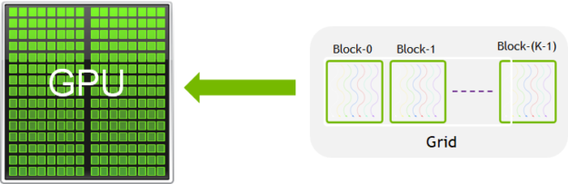
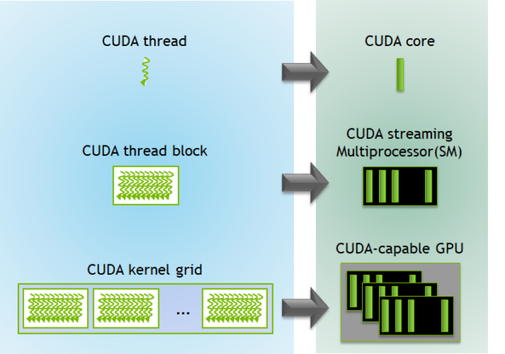

## Hybrid Computing Model

*From [CUDA Referesher Series](https://developer.nvidia.com/blog/tag/cuda-refresher/)*

GPUs were designed for highly parallel computations and were also referred to as throughput processors. Many scientific and AI workloads have inherent and massive parallelism in thier algorithms and may run very slowly in CPUs.

GPU-accelarated applications offload these time-consuming routines and functions to run on GPUs and take advantahe of massive parallelism.

Below figure shws the fundamental difference between CPUs and GPUs.

GPUs dedicate most of their transistors for data processing while CPUs also need to reserve die area for big caches, control units, and so on. CPU processors work on the principle of minimizing latency within each thread while GPUs hide the instruction and memory latencies with computation. 

## Introducing CUDA

The first challenge is to simplify parallel programming to make it easy to program. Easy programming attracts more developers and motivates them to port many more applications on parallel processors. The second challenge is to develop application software that transparently scales its parallelism to leverage the increasing number of processor cores with GPUs. 

This is where CUDA comes into picture

NVIDIA invented the CUDA programming model and addressed these challenges. CUDA is a parallel computing platform and programming model for general computing on graphical processing units (GPUs). With CUDA, you can speed up applications by harnessing the power of GPUs. 

CUDA provides a simple interface based on C/C++. A great benefit of the CUDA programming model is that it allows you to write a scalar program. The CUDA compiler uses programming abstractions to leverage parallelism built in to the CUDA programming model. This lowers the burden of programming. Here are some basics about the CUDA programming model. 

The CUDA programming model provides three key language extensions to programmers: 

1. **CUDA blocks** - A collection or group of threads
2. **Shared Memory** - Memory shared within a block among all threads
3. **Synchronization barriers** - Enable multiple threads to wait until all threads have reached a particular point of execution before any thread continues.

See [00_vector_addition.cu](https://github.com/MonitSharma/parallel_adventures/blob/main/cuda_kernels/01_cuda_basics/00_vector_addition.cu) for more. 

### Easy to Scale

The CUDA programming model allows scaling software transparently with an increasing number of processor cores in GPUs. You can program applications using CUDA language abstractions. Any problem or application can be divided into small independent problems and solved independently among these CUDA blocks. Each CUDA block offers to solve a sub-problem into finer pieces with parallel threads executing and cooperating with each other. The CUDA runtime decides to schedule these CUDA blocks on multiprocessors in a GPU in any order. This allows the CUDA program to scale and run on any number of multiprocessors. 

In the following image, the compiled CUDA program has eight blocks. the CUDA runtime can chose how to allocate these blocks to multiproceeors as shown with streaming multiprocessors (SMs)

### Libraries

Libraries are essential to providing drop-in performance for widely used common routines in any programming environment. They are well-optimized for the target compute architecture and are of high software quality. They also save application development time and provide the easiest way to get started with GPU acceleration.

NVIDIA provides a layer on top of the CUDA platform called CUDA-X, , which is a collection of libraries, tools, and technologies. GPU-accelerated CUDA libraries enable drop-in acceleration across multiple domains such as linear algebra, image and video processing, deep learning, and graph analytics. For developing custom algorithms, you can use available integrations with commonly used languages and numerical packages, as well as well-published development API operations.

The NVIDIA CUDA toolkit comes with a wide collection of commonly used libraries. Many partners also contribute many libraries on the CUDA platform. Here is a list of some widely used libraries: 

1. **Mathematical Libraries** - cuBLAS, cuRAND, cuFFT, cuSPARSE, cuTENSOR, cuSOLVER
2. **Parallel Algorithm Libraries** - nvGRAPH, Thrust
3. **Image and Video Libraries** - nvJPEG, NPP, Optical Flow SDK
4. **Communication Libraries** - NVSHMEM, NCCL
5. **Deep learning Libraries** -  cuDNN, TensorRT, Riva, DALI
6. **Partner Libraries** - OpenCV, FFmpeg, ArrayFire, MAGMA

## CUDA Kernel and Thread Hierarchy

The host is the CPU available in the system. The system memory associated with the CPU is called host memory. The GPU is called a device and GPU memory likewise called device memory.

To execute any CUDA program, there are three main steps:

- Copy the input data from host memory to device memory, also known as host-to-device transfer.
- Load the GPU program and execute, caching data on-chip for performance.
- Copy the results from device memory to host memory, also called device-to-host transfer.

See more of it in [Cuda Kernels Readme](https://github.com/MonitSharma/parallel_adventures/blob/main/cuda_kernels/01_cuda_basics/Readme.md)

---

CUDA kernel is a function that gets executed on GPU. The parallel portion of the application is executed K times in parallel by K different CUDA threads, as opposed to only one time like regular C/C++ functions.

Every CUDA kernel starts with a `__global__` declaration specifier. Programmers provide a unique global ID to each thread by using built-in variables.

A group of threads is called a CUDA block. CUDA blocks are grouped into a grid. A kernel is executed as a grid of blocks of threads. (as shown in above picture)

Each CUDA block is executed by one streaming multiprocessor (SM) and cannot be migrated to other SMs in GPU (except during preemption, debugging, or CUDA dynamic parallelism). One SM can run several concurrent CUDA blocks depending on the resources needed by CUDA blocks. Each kernel is executed on one device and CUDA supports running multiple kernels on a device at one time.

 